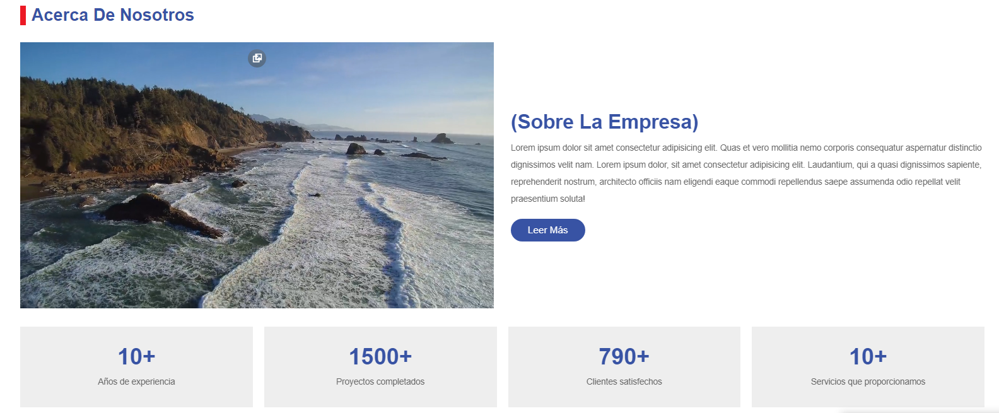
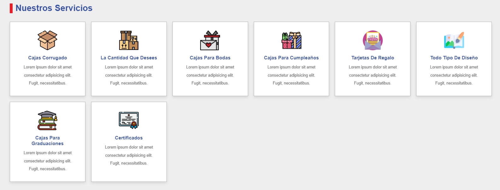
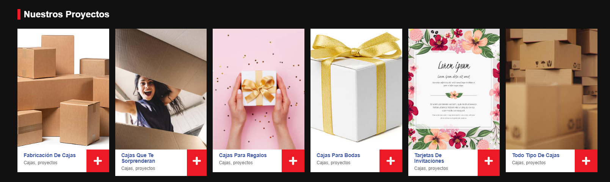
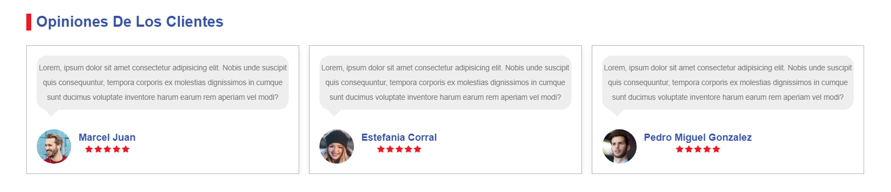
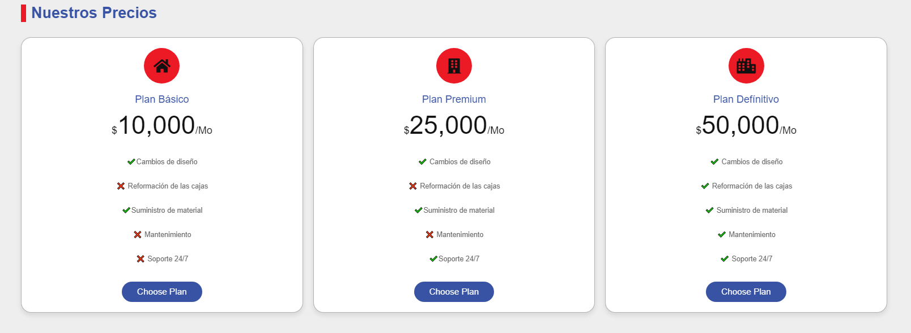
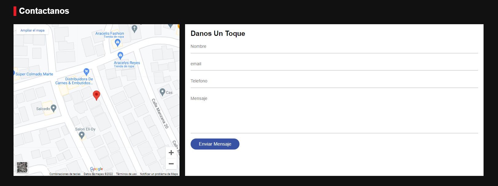
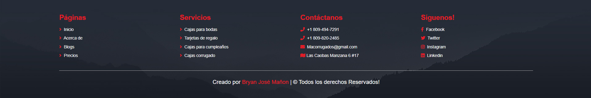

# MaCorrugados Landing Page

A fully functional sample project from Landing Page for any business or personal project, create using the following technologies:

 ## Table of contents:
- [Demo](#demo)
- [Usage](#usage)
- [Contribution](#contribution)
- [License](#license)
- [Screenshots](#screenshots)

## Demo 

Live project: https://macorrugados.netlify.app/

 ## Usage
  1- Download the project

2- Open in your ide favorite
 
 3- cd MaCorrugados-LandingPage

 4- Open index.html or use open server plugin in visual studio code

 ## Contribution

If you want to contribute to this project, follow these steps:

1-Fork the repository.

2-Create a new branch for your contribution.

3-Make your changes and improvements.

4-Submit a Pull Request.

## License

This project is licensed under the MIT License https://opensource.org/license/mit/.

# Screenshots

